# Cattle behavior classification with VLMs

This is an exploratory project evaluating whether vision-language models (VLMs) can classify cattle behavior in camera trap image crops using few-shot prompting, without requiring custom model training.


## Project overview

The system classifies individual cow crops from camera trap images into four behavioral categories:

- **head_up**: Head raised, looking forward/upward, or held level
- **head_down**: Head lowered, typically grazing or drinking
- **running**: Cow is clearly in motion
- **unknown**: Head position cannot be determined (obstructed, out of frame, etc.)

### Example images

**head_up** - head raised or level:

 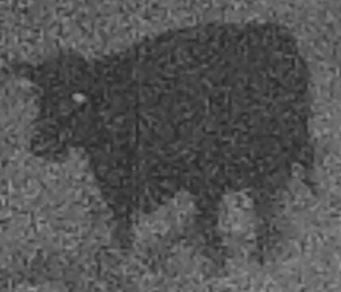 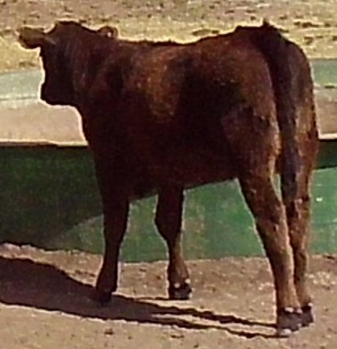 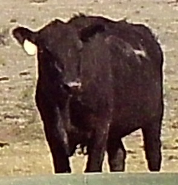

**head_down** - head lowered (grazing, drinking):

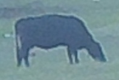 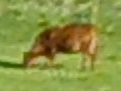 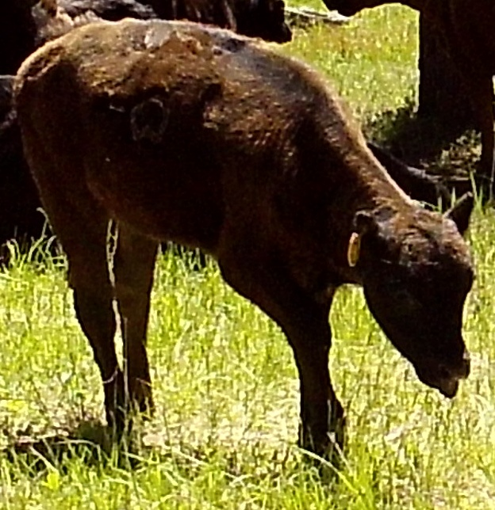 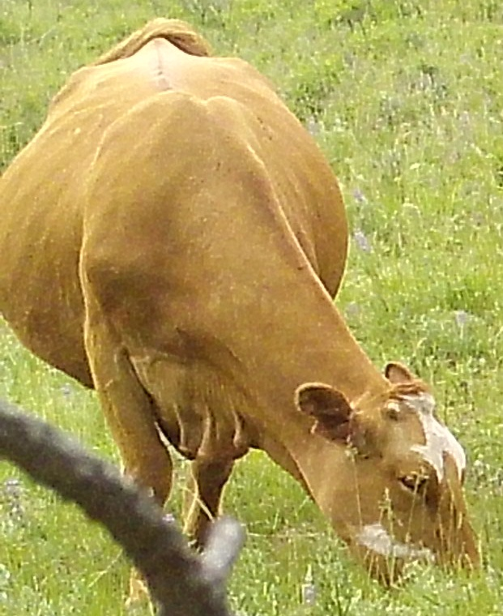

**running** - clearly in motion:

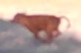 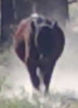 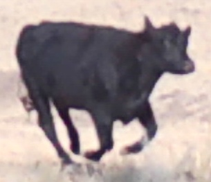 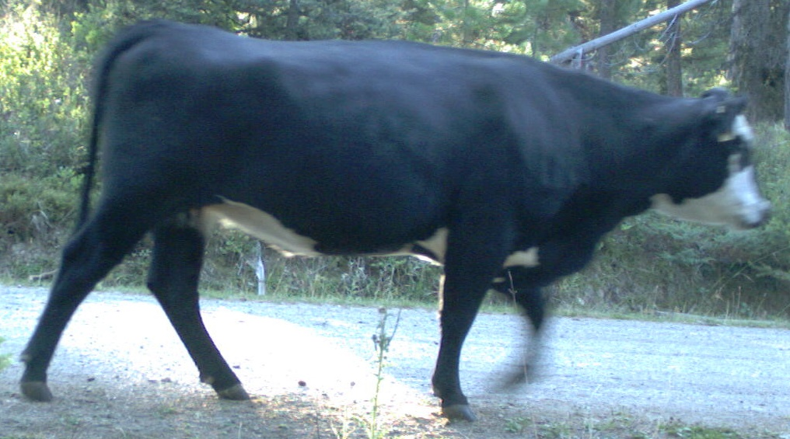

**unknown** - head position unclear (obstructed, partial view):

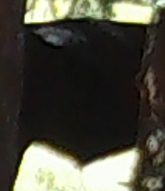 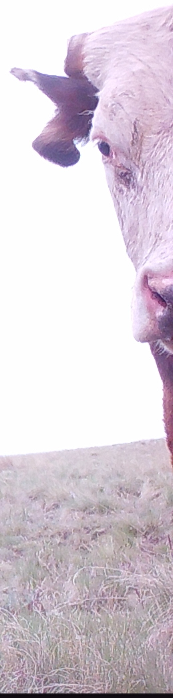 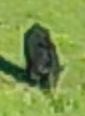 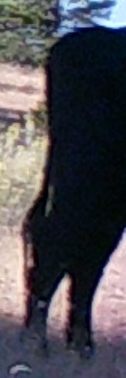

### Dataset

1,317 labeled cow crops (head_down: 604, head_up: 468, unknown: 234, running: 11) serve as ground truth, located in `C:\temp\cow-experiments\sorted_crops\` organized by category subfolder.

### Models tested

**Gemini (via Google Gemini API):**
- Gemini 3.0 Pro (`gemini-3-pro-preview`)
- Gemini 3.0 Flash (`gemini-3-flash-preview`)

**Ollama (local):**
- Qwen3-VL:32b, Qwen3-VL:8b
- Qwen2.5-VL:32b, Qwen2.5-VL:7b
- Gemma3:27b, Gemma3:12b
- Mistral Small 3.2:24b
- Ministral 3:14b, Ministral 3:8b
- Llama 3.2 Vision:11b (single-image-per-query only; see [model-specific notes](#model-specific-notes))


### Scripts

**Classification:**
- **`select_few_shot_examples.py`** - Measure image sizes and select 4 representative images per category for few-shot prompting
- **`run_gemini_classification.py`** - Gemini API classification (supports both batch and synchronous modes)
- **`run_ollama_classification.py`** - Local VLM classification via Ollama
- **`evaluate_results.py`** - Compute accuracy, confusion matrix, per-class metrics, and model comparison
- **`generate_cow_visualization.py`** - Create HTML visualizations for single-model and multi-model results

**Prompt/few-shot experiments:**
- **`sample_experiment_images.py`** - Sample balanced test set from model results for rapid experimentation
- **`create_prompt_variations.py`** - Generate prompt variation JSON configs
- **`create_few_shot_variations.py`** - Generate few-shot variation JSON configs
- **`run_prompt_experiment.py`** - Run experiments with specified prompt/few-shot/model combinations
- **`generate_experiment_visualization.py`** - Generate HTML visualizations for experiment results


### Utilities

- **`cow_vlm_utils.py`** - Shared utilities: image processing, prompt construction, response parsing, checkpointing, cost estimation

### Other files

- **`implementation-plan.md`** - Detailed implementation plan for future reference
- **`requirements.txt`** - Python dependencies
- **`prepare_cow_crops.py`**, **`validate_cow_labels.py`** - Existing preprocessing scripts (not modified by this project)


## Usage

### Setup

Install dependencies:

```bash
pip install -r requirements.txt
```

**For Gemini labeling:** Create an API key file:

```bash
echo "your-gemini-api-key" > GEMINI_API_KEY.txt
```

**For local VLM labeling (Ollama):** See [Ollama setup](#ollama-setup) below.

### Select few-shot examples

Run once to measure all image sizes and select representative examples:

```bash
python select_few_shot_examples.py
```

This creates `image_sizes.json` and `few_shot_examples.json` in the output directory.

### Classify images

All classification scripts produce the same JSON output format for compatibility with the evaluation and visualization tools.

#### Gemini (batch and sync modes)

The Gemini classification script supports two modes:

**Batch mode (default, recommended for full runs):**
- 50% cost discount vs. synchronous API
- Asynchronous processing (runs on Google's servers)
- Can resume/cancel jobs

```bash
# Classify with Gemini 3.0 Flash (batch mode)
python run_gemini_classification.py --model gemini-3-flash-preview

# Classify with Gemini 3.0 Pro (batch mode)
python run_gemini_classification.py --model gemini-3-pro-preview
```

Estimated costs for 1,301 query images (as of January 2026):
| Model | Batch API | Sync API |
|---|---|---|
| gemini-3-flash-preview | ~$0.45 | ~$0.89 |
| gemini-3-pro-preview | ~$1.77 | ~$3.56 |

**Synchronous mode (good for testing and smaller jobs):**
- 2x cost vs. batch mode
- Real-time processing with immediate results
- Supports checkpointing and resume

```bash
# Synchronous mode with auto-confirm (skip cost prompt)
python run_gemini_classification.py --model gemini-3-flash-preview --sync -y

# Test with a small number of images
python run_gemini_classification.py --model gemini-3-flash-preview --sync --max-images 10 -y

# Resume from checkpoint if interrupted
python run_gemini_classification.py --model gemini-3-flash-preview --sync --resume path/to/checkpoint.tmp.json
```

#### Ollama

```bash
# Classify with Qwen3-VL:32b
python run_ollama_classification.py --model qwen3-VL:32b

# Classify with Qwen2.5-VL:72b
python run_ollama_classification.py --model qwen2.5vl:72b

# Test with a small number of images
python run_ollama_classification.py --model qwen3-VL:32b --max-images 10

# Resume from checkpoint
python run_ollama_classification.py --model qwen3-VL:32b --resume path/to/checkpoint.tmp.json
```

#### Shared parameters

- `--image-size N` - Maximum dimension for resized images (default: 750)
- `--checkpoint-interval N` - Save progress every N images (default: 50, use 0 to disable)
- `--query-batch-size N` - Number of query images per API request (default: 5)
- `--few-shot-file FILE` - Path to few-shot examples JSON
- `--max-images N` - Limit number of images for testing
- `--max-retries N` - Number of retry rounds for failed images after the initial pass (default: 4)

#### Ollama-specific parameters

- `--num-ctx N` - Context window size in tokens (default: 16384). Many Ollama vision models default to 4096, which is too small for 16 few-shot images + query images. Increase if you see empty responses.
- `--num-predict N` - Maximum output tokens (default: 8192). Models with a thinking mode (e.g. qwen3-vl) consume output tokens for internal reasoning before producing content; a small value causes empty responses. Increase if you see warnings about thinking tokens consuming the budget.
- `--output-dir DIR` - Output directory for results

### Evaluate results

```bash
# Evaluate a single model's results
python evaluate_results.py path/to/results.json

# Compare all models in a results directory
python evaluate_results.py C:\temp\cow-experiments\cow-vlm-experiments\results --compare

# Save evaluation metrics to JSON
python evaluate_results.py path/to/results.json --output-dir path/to/evaluations
```

### Visualize results

```bash
# Single model visualization
python generate_cow_visualization.py path/to/results.json

# Multi-model comparison
python generate_cow_visualization.py C:\temp\cow-experiments\cow-vlm-experiments\results --compare

# Sample 200 images for faster HTML generation
python generate_cow_visualization.py path/to/results.json --sample 200

# Specify output directory
python generate_cow_visualization.py path/to/results.json --output-dir path/to/output
```


## Gemini batch job management

### Cancel a running batch job

```bash
# When you interrupt polling with Ctrl+C, the script shows the cancel command:
python run_gemini_classification.py --cancel batches/xyz789
```

Ctrl+C only stops the local script; the job continues running on Google's servers until cancelled.

### Resume batch jobs

```bash
python run_gemini_classification.py --resume path/to/gemini_batch_metadata_YYYYMMDD_HHMMSS.json
```

Resume behavior:
- **Running jobs**: Continues polling until completion
- **Completed jobs**: Immediately retrieves and saves results
- **Failed/cancelled jobs**: Shows status and exits

### Checkpoint/resume for sync mode and Ollama

- Checkpoints are saved automatically every 50 images (configurable with `--checkpoint-interval`)
- Resume with `--resume path/to/file.tmp.json`
- Checkpoint files are automatically cleaned up on successful completion
- Use `--checkpoint-interval 0` to disable for short jobs


## Ollama setup

1. If Ollama is not installed, download from https://ollama.com/download (Windows installer available).

2. Start the Ollama server in a separate terminal:

```bash
ollama serve
```

If you get a bind error, the server is likely already running as a Windows service.

3. Pull the models you want to test:

```bash
ollama pull qwen3-VL:32b
ollama pull qwen2.5vl:72b
```

4. Verify models are available:

```bash
ollama list
```

### Hardware notes

- This project was developed on a machine with 2x RTX 4090 (48GB VRAM total)
- qwen2.5vl:72b requires ~49GB VRAM; it will partially spill to CPU RAM on this hardware, which works but is slower
- qwen3-VL:32b fits comfortably in GPU memory
- The first request for each model may take several minutes while loading into GPU memory

### Troubleshooting

**Empty responses / 0% success rate:** Many Ollama vision models default to a small context window (e.g. 4096 tokens), which is too small for 16 few-shot images. The classification script sets `num_ctx=16384` by default. For models with thinking mode (qwen3-vl), also ensure `--num-predict` is large enough (default 8192); see [model-specific notes](#model-specific-notes).

**Timeouts during model loading:** set these environment variables before starting the server:

```bash
set OLLAMA_KEEP_ALIVE=1h
set OLLAMA_LOAD_TIMEOUT=30m
ollama serve
```

Other Ollama notes:

- Models are stored in `%USERPROFILE%\.ollama\models` by default
- List models with `ollama list`
- Remove models with `ollama rm <model_name>`
- Print setup instructions from the classification script: `python run_ollama_classification.py --setup-help`


## Model-specific notes

### llama3.2-vision

**Status: Excluded from default config** - This model returns 500 Internal Server Error when used with our few-shot prompting setup, even with `--query-batch-size 1`. The error persists regardless of the number of images in the query message, suggesting a memory or compatibility issue with the multi-turn few-shot conversation structure. The model has been removed from `model_run_config.json`.

Llama 3.2 Vision only supports **one image per message** in the Ollama `/api/chat` API. This is not a per-conversation limit -- multiple messages can each contain one image, so the few-shot prompting approach (16 user/assistant pairs with one image each) should work in theory. However, query batches must use `--query-batch-size 1` since each query message can only contain a single image.

### qwen3-vl (8b and 32b)

Qwen3-VL models have a "thinking" mode that generates internal reasoning tokens in a separate `message.thinking` field before producing visible content. These thinking tokens count against the `num_predict` budget. If `num_predict` is too small, the model exhausts its entire output budget on thinking and produces empty content (reported as `done_reason: length`). The classification script defaults to `--num-predict 8192` which is usually sufficient, but thinking length is non-deterministic -- the same prompt can produce anywhere from 1,000 to 30,000+ thinking tokens across runs. The retry mechanism helps with this: failed images are retried up to `--max-retries` times, and often succeed on subsequent attempts when the model happens to think more briefly.

**Full-run performance note (2026.02.03):** During full dataset classification, qwen3-vl:8b exhibited severe thinking token issues, with 75% of initial requests failing due to thinking budget exhaustion. Multiple retry rounds were needed to achieve full coverage. qwen3-vl:32b performed better but still required 4 retry rounds. This significantly increases runtime compared to non-thinking models.

**Potential fix:** The thinking behavior may be controllable via Ollama model parameters or by using a version of the model with thinking disabled. As of this writing, we have not tested disabling thinking mode -- this is a potential avenue for improving qwen3-vl performance on this task.

### gemini-3-pro-preview

**Thinking mode**: Gemini 3 Pro requires thinking mode and cannot disable it (`thinkingBudget=0` returns "This model only works in thinking mode"). By default, thinking is set to HIGH, which consumes many output tokens for internal reasoning before producing visible output. This causes empty responses with `finish_reason=MAX_TOKENS` when `max_output_tokens` is too low.

**Solution**: Set `thinkingConfig=ThinkingConfig(thinkingLevel='LOW')` in the API config. This reduces the thinking overhead and allows successful responses with `max_output_tokens=256`. The experiment scripts apply this setting automatically for Gemini Pro models.

**Rate limits**: Gemini Pro has stricter rate limits than Gemini Flash. Large runs may hit 429 RESOURCE_EXHAUSTED errors. The classification script includes per-request exponential backoff (up to 3 retries with 4s/8s/16s delays) and end-of-job retry rounds with escalating pauses between requests.


## Prompt and few-shot experiments

To explore whether classification accuracy could be improved through prompt engineering or different few-shot example selection, we ran a systematic experiment varying both the system prompt and the few-shot example set.

### Experiment design

We sampled 60 test images from the Gemini Flash results, balanced across four categories:
- 15 images correctly classified as head_up
- 15 images correctly classified as head_down
- 15 images misclassified head_up → head_down
- 15 images misclassified head_down → head_up

This balanced sample ensures equal representation of both correct classifications and error types, enabling rapid iteration (60 images vs 1,301 for full runs).

### Prompt variations

Five prompt variations were tested, all using the baseline few-shot examples:

| ID | Description |
|----|-------------|
| `v1_baseline` | Current prompt (simple category definitions) |
| `v2_back_reference` | Adds the cow's back line as a reference point for determining head position |
| `v3_explicit_examples` | Lists specific behaviors (grazing, drinking = head_down; alert, walking = head_up) |
| `v4_chain_of_thought` | Asks the model to reason step-by-step about head position relative to the back |
| `v5_negative_guidance` | Warns about common mistakes (e.g., "a slightly lowered head while walking is still head_up") |

### Few-shot variations

Five few-shot selection strategies were tested, all using the baseline prompt:

| ID | Description |
|----|-------------|
| `v1_baseline` | 4 images per category, quartile-based size selection (16 total) |
| `v2_more_examples` | 6 images per category (24 total) |
| `v3_fewer_examples` | 2 images per category (8 total) |
| `v4_largest_images` | 4 largest images per category (by pixel dimensions) |
| `v5_different_seed` | Different random selection (seed=42 vs baseline seed=12345) |

### Results summary

Experiments were run on 4 models: gemini-3-flash-preview, qwen2.5vl:32b, gemma3:27b, and mistral-small3.2:24b.

**Best overall result:** mistral-small3.2:24b with baseline prompt and fewer examples (8 total) achieved **60.0% accuracy** -- the highest across all 36 experiments.

**Best configuration per model:**

| Model | Best Prompt | Best Few-shot | Accuracy |
|-------|-------------|---------------|----------|
| mistral-small3.2:24b | v1_baseline | v3_fewer_examples | 60.0% |
| gemma3:27b | v4_chain_of_thought | v1_baseline | 55.0% |
| gemini-3-flash-preview | v5_negative_guidance | v1_baseline | 51.7% |
| qwen2.5vl:32b | v3_explicit_examples | v1_baseline | 40.0% |

**Key findings:**
- Fewer few-shot examples (8 instead of 16) improved mistral-small3.2 significantly (33.3% → 60.0%)
- Chain-of-thought and negative guidance prompts helped gemma3 and Gemini respectively
- More examples (24 total) generally hurt performance across all models
- Different random seeds for few-shot selection had minimal impact

### Experiment scripts

- **`sample_experiment_images.py`** - Sample balanced test set from model results
- **`create_prompt_variations.py`** - Generate prompt variation JSON files
- **`create_few_shot_variations.py`** - Generate few-shot variation JSON files
- **`run_prompt_experiment.py`** - Run experiments with specified prompt/few-shot/model combinations
- **`generate_experiment_visualization.py`** - Generate HTML visualizations with drill-down to individual images

### Running experiments

```bash
# Sample test images from existing results
python sample_experiment_images.py path/to/gemini_results.json

# Create prompt and few-shot variation configs
python create_prompt_variations.py
python create_few_shot_variations.py

# Run experiments (example: all prompts on one model)
python run_prompt_experiment.py --models gemini-3-flash-preview --prompts v1_baseline v2_back_reference v3_explicit_examples --few-shots v1_baseline

# Generate visualizations
python generate_experiment_visualization.py
```

Experiment results are saved to `C:\temp\cow-experiments\cow-vlm-experiments\experiments\results\` and visualizations to `experiments\visualizations\`.


## Data pipeline

```
Camera trap images
    | (MegaDetector detection)
    v
Individual cow crops (sorted by behavior category)
    | (select_few_shot_examples.py)
    v
16 few-shot examples + 1301 test images
    | (run_gemini_classification.py / run_ollama_classification.py)
    v
Classification results (JSON per model)
    | (evaluate_results.py / generate_cow_visualization.py)
    v
Accuracy metrics + HTML visualizations
```


## Output directory layout

All output goes to `C:\temp\cow-experiments\cow-vlm-experiments\`:

```
cow-vlm-experiments/
    image_sizes.json                 # all image dimensions
    few_shot_examples.json           # selected few-shot exemplars
    results/
        gemini-3-flash-preview_sync_YYYYMMDD_HHMMSS.json
        gemini-3-pro-preview_batch_YYYYMMDD_HHMMSS.json
        qwen3-VL-32b_YYYYMMDD_HHMMSS.json
        qwen2.5vl-72b_YYYYMMDD_HHMMSS.json
    checkpoints/
        *.tmp.json                   # in-progress checkpoints
    visualizations/
        YYYYMMDD/                    # datestamped visualization folders
            vis_images/              # shared thumbnails (200px)
            gemini-3-flash-preview.html  # per-model HTML pages
            comparison.html          # multi-model comparison page
            confusion_details/       # drill-down pages for confusion cells
    experiments/
        prompts/                     # prompt variation JSON configs
        few_shot/                    # few-shot variation JSON configs
        experiment_test_set.json     # sampled test images for experiments
        results/                     # per-experiment result JSONs
        visualizations/
            index.html               # experiment summary page
            *.html                   # per-experiment detail pages
            confusion_details/       # drill-down pages for confusion cells
            vis_images/              # shared thumbnails
```


## Technical notes

- **Image preprocessing**: Images >750px on the long side are downscaled; smaller images are NOT upscaled. All images are re-encoded as JPEG (quality 85).
- **Few-shot examples**: 4 images per category (16 total), selected to span the range of image sizes in the dataset.
- **Query batching**: 5 images per API request, with all 16 few-shot examples included in each request.
- **No category leakage**: Images are sent as base64 bytes only; file paths (which contain category folder names) are never included in prompts.
- **Output compatibility**: All classification scripts produce identical JSON format for evaluation and visualization.
- **Checkpointing**: Atomic write pattern (backup -> delete -> rename) prevents checkpoint corruption on interruption.

## Frequently-used commands

Commands used during development and experimentation:

```bash
# Check running Python processes
ps aux | grep python

# Run prompt/few-shot experiments (60-image test set)
cd "c:\git\agentmorrisprivate\archive\cow_experiments"
python run_prompt_experiment.py --models gemini-3-flash-preview --prompts v1_baseline v5_negative_guidance --few-shots v1_baseline

# Run full classification with custom prompt and few-shot
python run_gemini_classification.py --model gemini-3-flash-preview --sync -y \
    --prompt-file "C:/temp/cow-experiments/cow-vlm-experiments/experiments/prompt_variations/v5_negative_guidance.json" \
    --few-shot-file "C:/temp/cow-experiments/cow-vlm-experiments/experiments/few_shot_variations/v5_different_seed.json"

# Test with limited images
python run_gemini_classification.py --model gemini-3-flash-preview --sync -y --max-images 10

# Generate experiment visualizations
python generate_experiment_visualization.py

# Check experiment results
ls -la "C:/temp/cow-experiments/cow-vlm-experiments/experiments/results/"

# Inspect a result file for parse errors
python -c "
import json
with open('path/to/results.json') as f:
    data = json.load(f)
results = data['results']
parse_errors = [r for r in results if r.get('prediction') == 'parse_error']
print('Parse errors:', len(parse_errors))
for r in parse_errors[:5]:
    print('Raw:', repr(r.get('raw_response', ''))[:100])
"

# Check best Gemini Flash configurations
cd "C:/temp/cow-experiments/cow-vlm-experiments/experiments/results"
python -c "
import json, glob
for f in sorted(glob.glob('gemini-3-flash-preview_*.json')):
    with open(f) as fp:
        data = json.load(fp)
    res = data['results']
    pe = sum(1 for r in res if r.get('prediction') == 'parse_error')
    parsed = len(res) - pe
    correct = sum(1 for r in res if r.get('correct'))
    acc = correct/parsed if parsed else 0
    print('{:.1f}% ({}/{}) PE:{} {}'.format(100*acc, correct, parsed, pe, f[:50]))
"
```

Key file locations:
- Experiment results: `C:/temp/cow-experiments/cow-vlm-experiments/experiments/results/`
- Experiment visualizations: `C:/temp/cow-experiments/cow-vlm-experiments/experiments/visualizations/`
- Prompt variations: `C:/temp/cow-experiments/cow-vlm-experiments/experiments/prompt_variations/`
- Few-shot variations: `C:/temp/cow-experiments/cow-vlm-experiments/experiments/few_shot_variations/`
- Full run results: `C:/temp/cow-experiments/cow-vlm-experiments/results/`
- Full run visualizations: `C:/temp/cow-experiments/cow-vlm-experiments/visualizations/YYYYMMDD/`


## 2026.01.31 Results

### Parse error fix
Parse errors were caused by truncated responses ("head" instead of "head_up"). Fixed by:
- Increasing `max_output_tokens` from 100 to 256
- Adding retry logic (up to 3 retries per image)

Result: **0% parse error rate** on full dataset.

### Best configuration found
After testing 45 experiment combinations across 5 models:

**Winner: Gemini Flash + v5_negative_guidance prompt + v5_different_seed few-shot**
- 73.3% accuracy on 60-image experiment set (deliberately hard, balanced errors)
- **79.2% accuracy on full 1,301 image dataset**

### Full dataset results (1,301 images)

| Category | Accuracy | Correct/Total |
|----------|----------|---------------|
| head_down | 87.2% | 523/600 |
| head_up | 74.8% | 347/464 |
| unknown | 68.3% | 157/230 |
| running | 57.1% | 4/7 |
| **Overall** | **79.2%** | **1031/1301** |

### Key findings
1. **v5_negative_guidance prompt** significantly outperformed baseline across all models
2. **Fewer few-shot examples** (8 vs 16) helped some models (mistral)

### Visualization
- Experiment comparison: `experiments/visualizations/index.html`
- Full run results: `visualizations/20260131/gemini-3-flash-preview.html`
- Confusion matrix drill-down pages show individual images for each error type


## TODO

* Investigate head_up errors (74.8% vs 87.2% for head_down) - may need prompt refinement
* Test on new/unseen camera trap data to validate generalization
* Consider fine-tuning or additional prompt iterations for running/unknown categories

